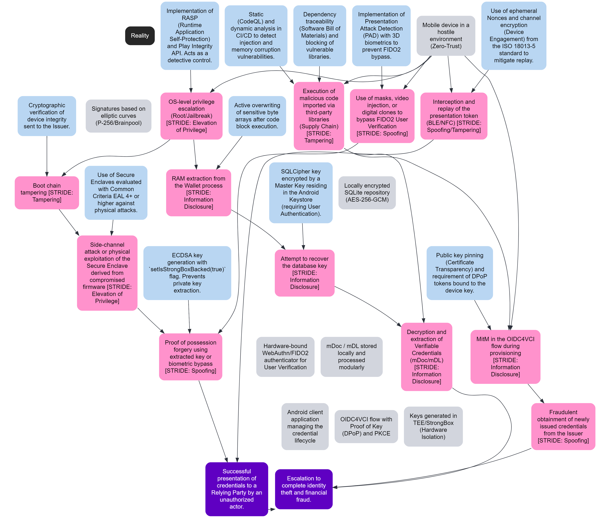

# EUDI Android Wallet Reference Application

⚠️ **Important!** Before you proceed, please read the
[EUDI Wallet Reference Implementation project description](https://github.com/eu-digital-identity-wallet/.github/blob/main/profile/reference-implementation.md).

---

## Table of Contents

- [EUDI Android Wallet Reference Application](#eudi-android-wallet-reference-application)
  - [Table of Contents](#table-of-contents)
  - [List of Abbreviations](./docs/listofAbbreviations.md)
  - [Overview](#overview)
  - [Protocols](#protocols)
  - [Security](./wiki/security_app.md)
  - [Security Flow Overview](#security-flow-overview)
  - [Anti-spoofing](./docs/anti-spoofing.md)
  - [License](./docs/liveness.md)
    - [License details](#license-details)

## Overview

The **EUDI Wallet Reference Implementation** is built based on the
[Architecture Reference Framework](https://github.com/eu-digital-identity-wallet/eudi-doc-architecture-and-reference-framework/blob/main/docs/architecture-and-reference-framework-main.md)
and aims to showcase a robust and interoperable platform for digital
identification, authentication, and electronic signatures based on common
standards across the European Union.

The implementation follows a **modular architecture** composed of
business‑agnostic, reusable components that evolve incrementally and can be
re‑used across multiple projects.

The EUDI Wallet enables users to:

1. Obtain, store, and present PID and mDL.
2. Verify credential presentations.
3. Share data in proximity scenarios.
4. Support remote QES and other use cases via the bundled modules.
5. Perform anti‑spoofing checks, verify credentials, and manage holder
   configuration.

The **EUDIW** project provides this repository with an Android app.
Please refer to the repositories listed in the subsequent sections for
more detailed information on how to get started, contribute, and engage with
the EUDI Wallet Reference Implementation.

## Protocols

- **OpenID Federation** for OpenID Connect 1.1
- **OpenID Connect** for Verifiable Credential Issuance
- **OpenID Connect** for Verifiable Presentations

## Security

The EUDI Android Wallet adopts a defense-in-depth approach that combines strong cryptography, hardware-backed key storage, and multiple layers of authentication/verification. The main pillars are described below.

---

## License
### License details

Copyright (c) 2026 European Commission

Licensed under the European Union Public Licence (EUPL) version 1.2 or,
as soon as it is approved by the European Commission, any subsequent
version of the EUPL (the “Licence”). You may not use this work except in
compliance with the Licence.

You may obtain a copy of the Licence at:
https://joinup.ec.europa.eu/software/page/eupl

Unless required by applicable law or agreed to in writing, software
distributed under the Licence is distributed on an “AS IS” basis,
WITHOUT WARRANTIES OR CONDITIONS OF ANY KIND, either express or implied.
See the Licence for the specific language governing permissions and
limitations under the Licence.
