# Anti-Spoofing

The `AnalyzerGuilinecCardService` acts as the primary defense line against presentation attacks (*spoofing*) during identity document capture. Rather than relying exclusively on artificial intelligence models, the system employs a deterministic approach based on computational geometry, signal processing (Frequency Analysis), and sensor fusion (accelerometer and gyroscope) to detect spoofing patterns. This architecture was designed to be resource-efficient, ensuring fast and accurate responses even on mobile devices with processing constraints.

The final result is a weighted score, calculated from multiple attack vectors, which classifies the sample into one of three categories: authentic document, screen attack (digital reproduction), or printed copy.

The spoofing detection processes are orchestrated by a Finite State Machine (FSM), responsible for managing the sequence of mathematical calculations:

## Dichromatic Reflection Analysis

Light incident on an object is divided into diffuse reflection and specular reflection. Analyzing the proportion between these two types of reflection allows distinguishing a genuine physical object from a flattened image (printed or digital), since real objects exhibit distinct specular reflection ratios compared to two-dimensional surfaces.

The captured image is converted to the YCbCr color space, where the Y channel represents luminance and the Cb and Cr channels represent chrominance. The analysis is performed independently for each channel, isolating reflection patterns characteristic of the object's materiality. The algorithm calculates the ratio of supersaturated pixels (indicative of specular reflection) relative to the total pixels in the sample, using an empirically calibrated threshold to classify the capture as authentic or *spoofing*.

## Moiré Pattern Detection

Mitigating replay attacks on digital screens is achieved through Moiré pattern detection — visual interference generated when a pixel mesh from a screen overlaps with the image sensor's capture matrix. The algorithm employs image processing techniques to isolate these anomalies, which are strong indicators of a *spoofing* attempt via a digital device.

The calculation involves applying a high-frequency Laplacian filter to enhance edges and image microdetails. Subsequently, a Fast Fourier Transform (FFT) is performed to identify the presence of structured periodic patterns. Detection of anomalous magnitude peaks in the frequency domain signals high probability of an attack executed through a screen.

## OVI Consistency via Gyroscope

To combat the use of high-resolution photocopies and static photographs lacking natural movement, the system calculates the camera's angular difference between successive *frames*, extracting data from the device's gyroscope (with emphasis on the *Yaw* axis). If the angular variation is below a minimum threshold established during the capture window, the system flags the sample as suspected static presentation.

In parallel, during document data extraction, the system calculates the 3D Euclidean distance of the mean RGB value between *frames*. This calculation aims to detect the presence of Optically Variable Inks (OVI) and holograms, which exhibit dynamic color and light intensity variations under different perspective angles. Null or insignificant chromatic variation suggests the absence of genuine optical security elements, typifying a printed copy attack.

## Injection Attack Prevention

Beyond visual inspection techniques, the system incorporates preventive controls against camera *bypasses*. To mitigate static *frame* injection, a duplication detection mechanism is implemented: each captured *frame* is compared with immediate history through a perceptual *hashing* function.

Using Hamming distance calculation between *frame* *hashes*, the system evaluates the video stream. If an identical sequence is detected beyond an acceptable consecutive tolerance limit, the system infers an injection attempt, blocking the capture or requiring the holder to move the device to prove session authenticity.

Aggregating these mathematical verification steps enables the system to certify not only the semantic validity of the presented document but also its three-dimensional physical integrity. By correlating frequency-domain behaviors with geometric and photometric integrity in real-time, the engine achieves the institutional confidence level required for secure issuable verifiable credentials.

---

### Anti-Spoofing Techniques for Facial Liveness Detection

The architecture supports extensibility for biometric validation through the following complementary techniques:

- **Dichromatic Reflection Analysis:** Detection of flat surfaces (paper masks or screens)
- **Normal Vector Field Estimation:** Microtexture analysis to validate volumetry
- **Moiré Pattern Detection:** High-density digital screen filtering
- **Frequency Analysis (FFT):** Identification of synthetic non-natural periodic patterns
- **OVI Verification Combined with Accelerometer:** Hologram validation synchronized with movement
- **Planar Homography Consistency:** Object rigidity detection (distinction between flexible real features and rigid reproductions)
- **3D Depth Analysis:** Topographic mapping with ARCore assistance

```mermaid
flowchart LR
    classDef input fill:#AED6F1,stroke:#2C7DA7,stroke-width:2px,color:#000
    classDef stage fill:#A2D9CE,stroke:#1ABC9C,stroke-width:2px,color:#000
    classDef decision fill:#F8C471,stroke:#E67E22,stroke-width:2px,color:#000
    classDef outputNode fill:#F9E79F,stroke:#F4D03F,stroke-width:2px,color:#000,font-weight:bold
    classDef parallel fill:#D7BDE2,stroke:#9B59B6,stroke-width:2px,color:#000
    classDef noteNode fill:#FEF9E7,stroke:#F4D03F,stroke-width:1px,stroke-dasharray: 5 5,color:#000,font-size:12px

    Cam([Video Feed Capture<br>Hardened Sensor Access]):::input

    subgraph FASE_QUALIDADE ["Sanitation and Quality Phase - DoS Prevention"]
        L1[Stage 1: Image Quality Gate<br>Laplacian Filter / Brightness / Contrast]:::stage
        L2[Stage 2: Sensor Warm-up<br>Discard first N frames]:::stage
    end

    subgraph FASE_PAD ["Presentation Attack Detection - PAD Phase"]
        L3[Stage 3: Temporal Aggregation<br>Sliding window of W frames]:::stage
        L4[Stage 4: Active Liveness Check<br>Movement/rigidity detection]:::stage
        Decision{Decision Engine<br>Anti-Spoofing verdict}:::decision
    end

    OCR[Parallel Processing<br>OCR Pipeline]:::parallel

    Poor([Output: PoorImageQuality<br>Early Rejection]):::outputNode
    Fail([Output: SecurityCheckFail<br>Attack Vector Blocked]):::outputNode
    Guidance([Output: GuidanceNeeded<br>Soft Degradation / Retry]):::outputNode
    Success([Output: Success<br>Liveness Proof Authenticated]):::outputNode

    Cam --> L1
    Cam -->|Asynchronous| OCR

    L1 -->|Validation Passed| L2
    L1 -->|Reject| Poor

    L2 -->|Stable Frames| L3
    L3 --> L4
    L4 --> Decision

    Decision -->|Biometric Attack| Fail
    Decision -->|Marginal/Suspicious| Guidance
    Decision -->|Genuine| Success
```

---

## References

1. [FFT Magic: Unlocking the Secrets of Signals with Python and the Intuition Behind It](https://medium.com/data-science-collective/fft-magic-unlocking-the-secrets-of-signals-with-python-and-the-intuition-behind-b43915185b5d)
2. [Similarity Hashing and Perceptual Hashes](https://billatnapier.medium.com/similarity-hashing-and-perceptial-hashes-963fba36c8b5)
