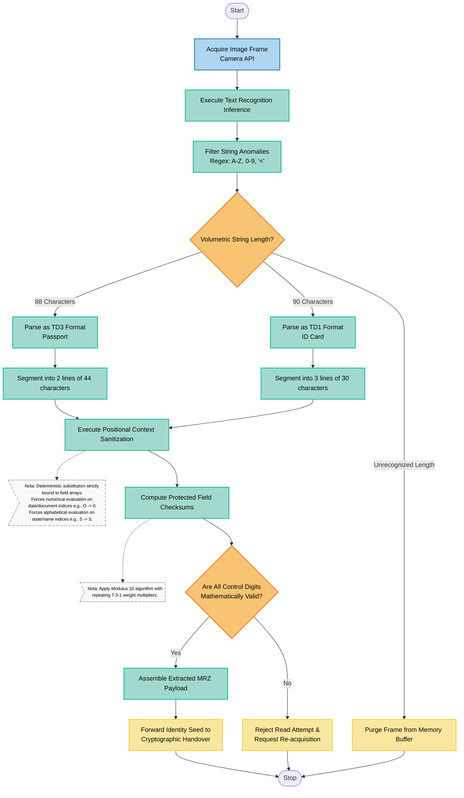

# Engineering Architecture for Phygital Identity: Convergence Between ICAO 9303 and ISO 18013-5

The architecture proposed here for *phygital* (physical-digital) identity systems focuses on the convergence between international document issuance standards (ICAO 9303) and modern image processing and Optical Character Recognition (OCR) technologies. This approach establishes the foundation for robust identity verification and digital onboarding systems in mobile environments.

The process of capturing and validating physical identity documents (such as biometric passports and national identity cards) is the central axis for the transition toward and issuance of Verifiable Credentials (VCs) within Digital Identity Wallets. The technical implementation requires state-of-the-art OCR for extracting the Machine Readable Zone (MRZ), coupled with rigorous deterministic validation algorithms to ensure the integrity and authenticity of the extracted data.

## 1. Data Mapping: ICAO 9303 to mDoc (ISO 18013-5)

For the issuance of credentials compliant with the international standard for mobile driving licenses and digital identities (mDoc), it is imperative to map MRZ data (also present in Data Group 1 - DG1 of the NFC chip) into the specific mDoc namespace.

**Table 1: ICAO 9303 to ISO 18013-5 Data Mapping**

| **ICAO 9303 Element (MRZ/DG1)** | **ISO 18013-5 Namespace** | **ISO 18013-5 Identifier** | **Implementation Notes**                                                     |
| ------------------------------- | ------------------------- | -------------------------- | ---------------------------------------------------------------------------- |
| Given Names                     | `org.iso.18013.5.1`       | `given_name`               | Extracted from Line 1 or 2 (Secondary Identifier).                           |
| Family Name / Surname           | `org.iso.18013.5.1`       | `family_name`              | Extracted from Line 1 or 2 (Primary Identifier).                             |
| Date of Birth                   | `org.iso.18013.5.1`       | `birth_date`               | Format YYYY-MM-DD (requires computational century inference).                |
| Expiry Date                     | `org.iso.18013.5.1`       | `expiry_date`              | Full YYYY-MM-DD format.                                                      |
| Document Number                 | `org.iso.18013.5.1`       | `document_number`          | Direct mapping (alphanumeric string).                                        |
| Issuing Authority               | `org.iso.18013.5.1`       | `issuing_authority`        | Three-letter ICAO code converted to the official country/entity designation. |
| Sex                             | `org.iso.18013.5.1`       | `sex`                      | Requires conversion from MRZ tags (M/F/<) to ISO 5218 codes.                 |
| Facial Image (DG2)              | `org.iso.18013.5.1`       | `portrait`                 | Binary blob (JP2/JPEG) cryptographically extracted via NFC.                  |

## 2. Optical Capture and Processing Pipeline (OCR)

The underlying mobile architecture (Android) operates in strict compliance with ICAO 9303. The processing workflow is modular, separating the responsibilities of optical capture, mathematical validation, and hardware interfacing (NFC), thereby ensuring resilience and maintainability.

### 2.1. Image Acquisition and Extraction Engine

Upon capture initialization, the system uses the **CameraX API**, integrating an `ImageAnalyzer` component that streams real-time frames into the OCR engine. The **ML Kit Text Recognition** library was selected due to its ability to operate entirely offline, ensuring low latency, privacy preservation, and high edge-processing performance.

The architecture should not process the entire visual noise present in the document. Instead, detection models isolate the dense OCR-B text lines located in the lower MRZ region.

### 2.2. Normalization and Format Detection

The primary output produced by ML Kit frequently contains image artifacts translated into textual noise. The pipeline applies sequential processing stages:

1. **Character Sanitization:** Regular expression filters remove spaces and preserve only the ICAO character set (A-Z, 0-9, and the filler character `<`).
2. **Format Heuristics:**

    * **TD3 (Passport):** Buffer contains 88 characters arranged in two lines of 44 characters each.
    * **TD1 (Identity Card):** Buffer contains 90 characters arranged in three lines of 30 characters each.
    * **MRV (Visa):** Two lines of 36 characters.

### 2.3. Confusion Matrix and Heuristic Resolution

OCR systems remain susceptible to deterministic recognition failures in OCR-B typography. The parser implements heuristic substitution logic that is strictly activated only when the initial checksum validation fails:

* `O` (letter) versus `0` (digit)
* `I` (letter) versus `1` (digit) — Critical error because "I" has a value of 18 in the algorithm, whereas "1" has a value of 1.
* `S` (letter) versus `5` (digit)
* `B` (letter) versus `8` (digit)

## 3. Cryptographic and Mathematical Validation (MRZ Checksum)

No data extracted through OCR should be propagated into business logic without formal validation of the control digits. ICAO 9303 mandates verification using a weighted Modulo-10 algorithm.

### Validation Algorithm

1. **Value Assignment:** Digits retain their numeric values (0-9). Letters are assigned numeric values (A=10 through Z=35). The filler character `<` is assigned 0.
2. **Cyclic Weighting:** Each character is multiplied by a sequential weight pattern: `7, 3, 1, 7, 3, 1...`
3. **Mathematical Equation:**

[
D = \left( \sum_{i=1}^{n} \text{Value}_i \times \text{Weight}_i \right) \bmod 10
]

**System Behavior:** If **D** does not match the control digit read from the MRZ, the parser interacts with the confusion matrix, recalculates the checksum iteratively, and verifies whether the heuristic substitution produces a checksum identical to the expected value.

## 4. Biometrics and Anti-Spoofing (FaceID)

Validation of the physical document is insufficient unless the system can guarantee that the device holder is both the legitimate owner and physically present during the authentication process.

* **Facial Segmentation:** Rapid identification and isolation of facial bounding boxes extracted from the camera feed.
* **Confidence Masking:** Pixel-level confidence scoring for detected facial regions.
* **Liveness Analysis:** Verification of illumination conditions, saturation levels, and three-dimensional motion patterns to detect presentation attacks such as photographs or display screens.

## 5. Technical Implementation Challenges and Mitigation Strategies

### 5.1. Perspective and Geometric Distortion

Users rarely position documents perfectly parallel to the camera sensor. The system applies **Perspective Transformation** algorithms (skew and tilt correction) and homography techniques to normalize images before submission to the ML Kit engine.

### 5.2. Deep Learning Model Limitations (Autoencoders)

Neural networks employed for super-resolution or image denoising (such as Autoencoders) tend to blur fine-grained details into gray-scale gradients, degrading the security features and contrast characteristics of identity documents.

**Mitigation:** Prioritize lightweight linear preprocessing techniques with strong contrast enhancement (adaptive thresholding and binarization) instead of computationally intensive deep-learning models during the pre-OCR phase.

### 5.3. Cross-Reference Validation (NFC)

As a final defense against high-quality printed counterfeits, the architecture should enforce pairing with the embedded chip through **NFC (BAC/PACE protocols)**. The mathematically validated OCR data serves as the access key (password) for unlocking and reading the cryptographic chip, thereby confirming document integrity with a high degree of assurance.

## Documentary References

* **ICAO Doc 9303 (Machine Readable Travel Documents):** https://www.icao.int/publications/pages/publication.aspx?docnum=9303
* **How to Enhance Images with Neural Networks (FreeCodeCamp):** https://www.freecodecamp.org/news/how-to-enhance-images-with-neural-networks/
