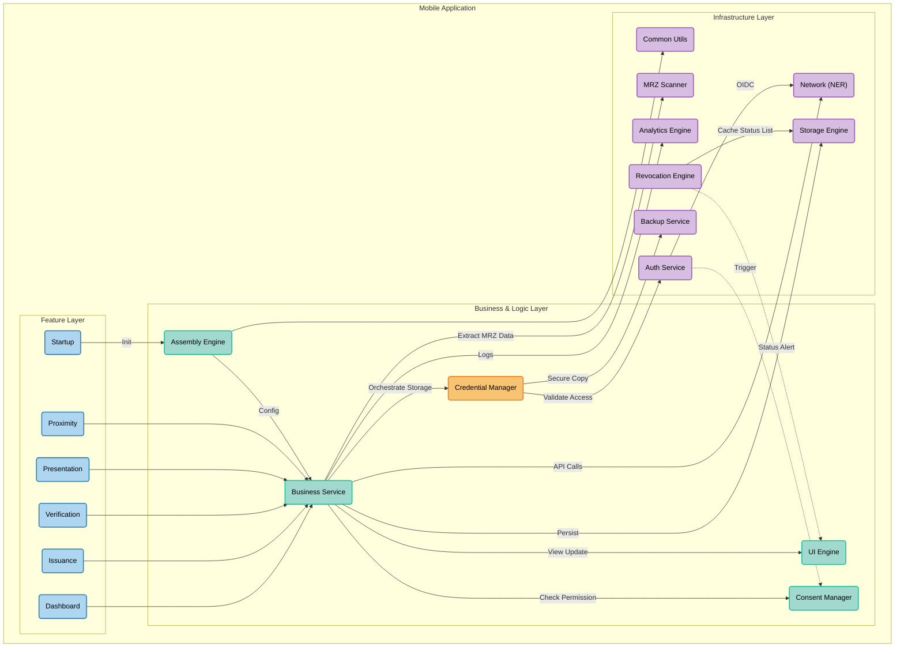

# Architecture Modules

During the development of this work, the `eudi-lib-android-wallet-core` library was utilized, which is framed within the EU Digital Identity Wallets ecosystem. Additionally, other supporting libraries were used, as detailed in Table \ref{tab:bibliotecas}. Some of these dependencies have already been addressed in previous sections, where a more in-depth description of the involved protocols can be consulted.

The project structure is based on Clean Architecture principles, promoting the separation of concerns through a modular organization, described below:

## Data Layer (WSDA)

This layer is responsible for all data persistence and safekeeping within the application.

* **Storage:** Local data persistence mechanisms, whose architecture has been optimized to ensure greater security and efficiency.
* **Backup:** A recently implemented feature to ensure the safeguarding and reliable recovery of user information.

## Trust Data

* **Authentication:** Manages identity verification and access control processes. The security mechanisms inherent to this module have been reinforced and refined.

## Domain Data

This section groups the modules responsible for configuration, dependency management, and pure business rules:

* **`assembly-logic`**: Responsible for the orchestration and injection of application dependencies.
* **`build-logic`**: Aggregates the global configurations and Gradle plugins required for the uniform compilation of the project.
* **`resources-logic`**: Centralizes all static application resources (such as images, strings, typography, etc.), facilitating their sharing across modules.
* **`business-logic`**: Contains the core business rules of the application, which have been recently refactored and optimized.
* **`core-logic`**: Groups the core logic and cross-cutting utilities, providing a solid foundation for the remaining functional modules.

## Resources Hub & Features

This section contains the user-centric modules and the specific features of the digital wallet:

* **`ui-logic`**: Concentrates the entire design system and the visual components of the User Interface (UI).
* **`common-feature`**: Provides cross-cutting infrastructure and abstractions for hardware and security components (such as biometric authentication mechanisms, Bluetooth, NFC, and Wi-Fi Aware), allowing the remaining modules to utilize them in an agnostic manner.
* **`dashboard-feature`**: Manages the main interface and the user dashboard (optimized module).
* **`startup-feature`**: Orchestrates the initialization flow, ensuring secure startup and the verification of application prerequisites.
* **`presentation-feature`**: Responsible for the preparation and orchestration of the credential presentation flow to the verifier (Relying Party), implementing the OpenID4VP (OpenID for Verifiable Presentations) protocol.
* **`issuance-feature`**: Manages communication with issuers to obtain new credentials, ensuring compliance with the OpenID4VCI (OpenID for Verifiable Credential Issuance) protocol.
* **`proximity-feature`**: Implements proximity (*offline*) credential sharing mechanisms, in strict compliance with the ISO/IEC 18013-5 standard (e.g., Mobile Driving Licence - mDL).
* **`consent-user-feature`**: Manages the interface and logic for collecting the holder's explicit consent during data sharing and identification interactions.
* **`mrz-logic`**: Implements the logic for optical data extraction by reading the Machine Readable Zone (MRZ) of physical documents (such as the Citizen Card or Passport), facilitating the self-issuance process of credentials.

# Mobile Application Architecture (EUDI Wallet Style)

