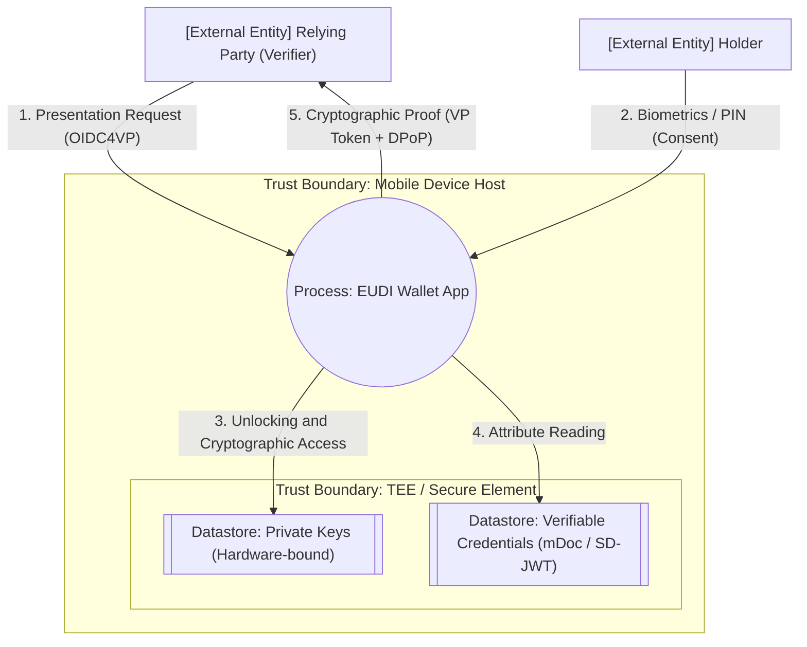

## 3. Matriz Analítica: STRIDE-per-Element e Controlos eIDAS 2.0

# Threat Modeling of the EUDI Wallet (eIDAS 2.0): STRIDE Methodology

## 1. Methodological Framework and Foundations

Threat modeling is operationalized through the systematic answering of four fundamental questions of systems security engineering (Adam Shostack's *The Four-Question Framework*):

1. **What are we building?** (Architectural Modeling via DFD and Trust Boundaries).
2. **What can go wrong?** (Threat Elicitation structured via the STRIDE matrix).
3. **What are we going to do about it?** (Mitigation Engineering in the ARF context).
4. **Did we do a good job?** (Validation, DevSecOps Auditing, and Retrospective).

The application of the STRIDE taxonomy to the EUDI Wallet (EUDI-W) ecosystem allows for the systematization of the exhaustive identification of vulnerabilities in the design architecture, the application of technical controls (OIDC4VCI and OIDC4VP), and the continuous validation of the topology and hardware shielding required by the *Architecture and Reference Framework* (ARF).

---

## 2. Architectural Modeling: Data Flow Diagram (DFD)

The analysis focuses on the critical Credential Presentation flow to a Relying Party, utilizing the OpenID4VP protocol.

## 3. Analytical Matrix: STRIDE-per-Element and eIDAS 2.0 Controls

To ensure analytical rigor, threats are evaluated against the specific DFD elements to which they inherently apply.

| **Threat (STRIDE)**        | **Target Element in DFD**  | **Attack Vector in the Infrastructure (eIDAS / OIDC)**                                                                                | **Architectural and Cryptographic Mitigation (ARF)**                                                                                                                                                          |
| -------------------------------- | -------------------------------- | ------------------------------------------------------------------------------------------------------------------------------------------- | ------------------------------------------------------------------------------------------------------------------------------------------------------------------------------------------------------------------- |
| **Spoofing**               | External Entities, Processes     | Creation of malicious endpoints (fake Relying Parties). Use of fraudulent discovery URLs to capture authorization codes.                    | Mutual authentication (mTLS) between RP and wallet. Use of**DPoP**to bind the request to the proof of possession of the key. Strict validation of*Metadata Statements*against the EU *Trust List* .       |
| **Tampering**              | Data Flows, Datastore, Processes | Interception and modification of attributes (PID, address) in transit (*MitM* ). Alteration of static credentials in memory or backups.   | Native cryptographic signature (SD-JWT and mDoc). JWS/COSE integrity verification against the public keys in the*Trust Lists* . Payload isolation in**TEE / Secure Element**(KeyStore).                     |
| **Repudiation**            | Processes, External Entities     | The user denies the authorship of a sharing consent, or the RP denies the receipt of a critical transaction.                                | Application of Qualified Electronic Signatures (**QES** ). Wallet Unit Attestation (WUA) certifying the origin. Immutable local logs and use of unique cryptographic identifiers ( *nonce* , *jti* ).     |
| **Information Disclosure** | Data Flows, Datastore, Processes | Exfiltration of confidential attributes. Tracking of usage patterns through the correlation of multiple transactions (*linkability* ).    | **Selective Disclosure**inherent to the SD-JWT format. Use of*Pairwise Pseudonymous Identifiers*to unlink the holder. Future implementation of Zero-Knowledge Proofs ( **ZKP** ) via BBS+ signatures. |
| **Denial of Service**      | Processes, Data Flows            | Request overload at state verification endpoints. Hostile consumption of mobile resources by validating exhaustive X.509 chains.            | Obfuscation of sensitive and heavy parameters in the URL via*Pushed Authorization Requests*( **PAR** ).*Rate-limiting*and strict*timeout*management in the*Wallet App*interface.                      |
| **Elevation of Privilege** | Processes                        | Compromise of the operating system (*kernel*exploitation,*root*access, or *jailbreak* ) for the extraction of cryptographic material. | Absolute hardware confinement (StrongBox/SE). Real-time*Key Attestation* . Heuristic evaluation of the mobile OS compromise state (e.g., *Play Integrity API* ).                                                |

## 4. Quality Assurance and DevSecOps (Security Pipeline)

Beyond the structural vulnerabilities mapped by STRIDE, the continuous resilience of the wallet requires the mitigation of dynamic temporal attacks and systematic implementation failures. Within the scope of OpenID4VP, the risk of *Replay Attacks* is neutralized through the injection of *nonces* (ephemeral values generated by the Verifier), binding the presentation proof to the strict current session.

The integrity and sovereignty of this ecosystem postulate that the architecture must be supported by a highly restrictive DevSecOps  *pipeline* , focusing on code security and the shielding of the Software Supply Chain. The prevention of security regressions requires the orchestration of the following controls:

* **SAST (Static Application Security Testing):** Analytical engines integrated into CI/CD pipelines to identify vulnerabilities directly in the source code. The joint use of robust platforms like **SonarQube** or  **CodeQL** , combined with the speed and flexibility of **Semgrep** (through the application of custom syntactic rules for OIDC/COSE libraries), allows the detection of logical flaws and unsafe use of cryptographic APIs in Java/Kotlin (e.g., inadequate key management in the heap, weak entropy, or deprecated algorithms).
* **SCA (Software Composition Analysis) and Automation:** Continuous auditing of imported third-party libraries (such as JWT/SD-JWT processors). The integration of tools like **Dependabot** ensures not only the identification of *Common Vulnerabilities and Exposures* (CVEs) in the dependency graph but also the automation of the patching cycle, reducing the window of exposure to known vulnerabilities.
* **Supply Chain Security:** To mitigate attack vectors focused on the compromise of the development infrastructure (infiltration of repositories and alteration of artifacts), the EUDI Wallet build process must adhere to the **OpenSSF** ( *Open Source Security Foundation* ) guidelines. This materializes through compliance with the **SLSA** ( *Supply-chain Levels for Software Artifacts* ) framework, ensuring cryptographic build provenance, traceability, and immutability of the final generated binaries.
* **Runtime Integrity (Attestation):** Monitoring of tampering in the state of the host device during the operation phase. It is deterministically ensured that the *Ring 0* (Kernel) environment is not subverted by *rootkits* or *jailbreak/rooting* processes before authorizing the escalation of privileges to access the wallet's secure element.
